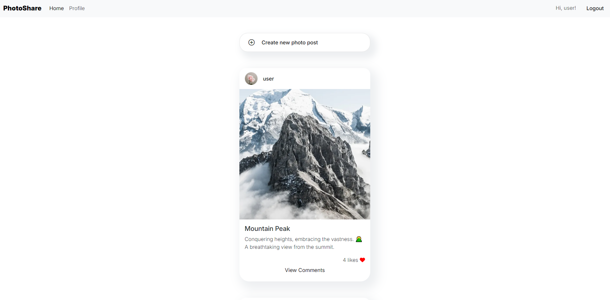
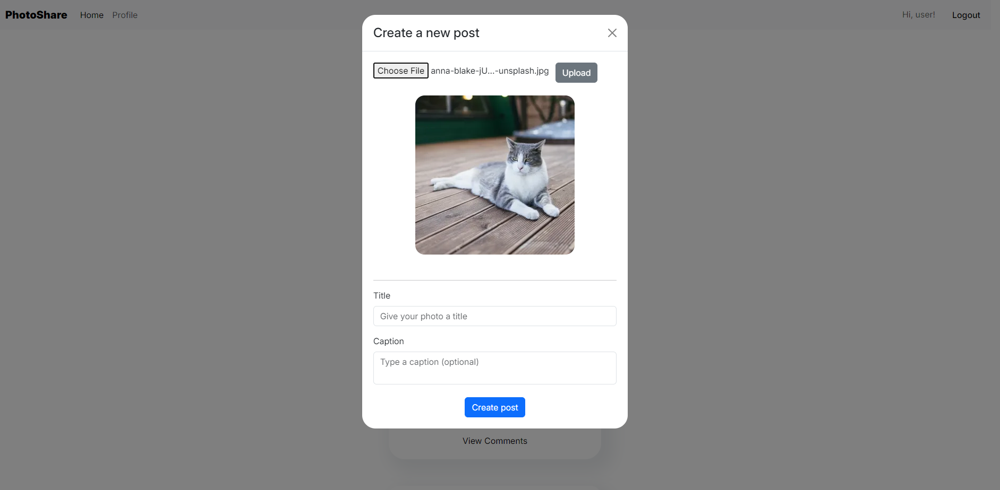
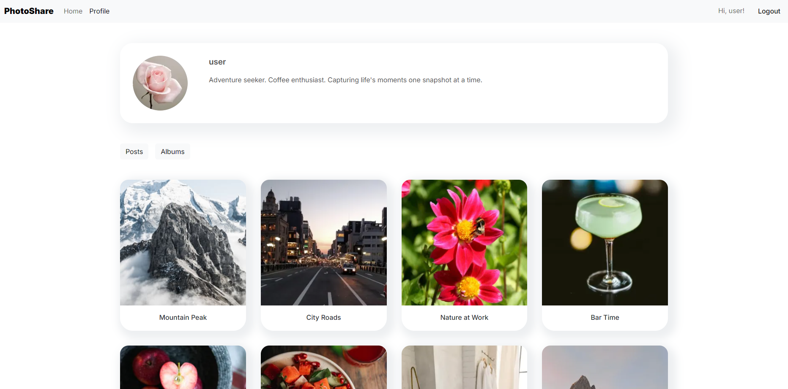
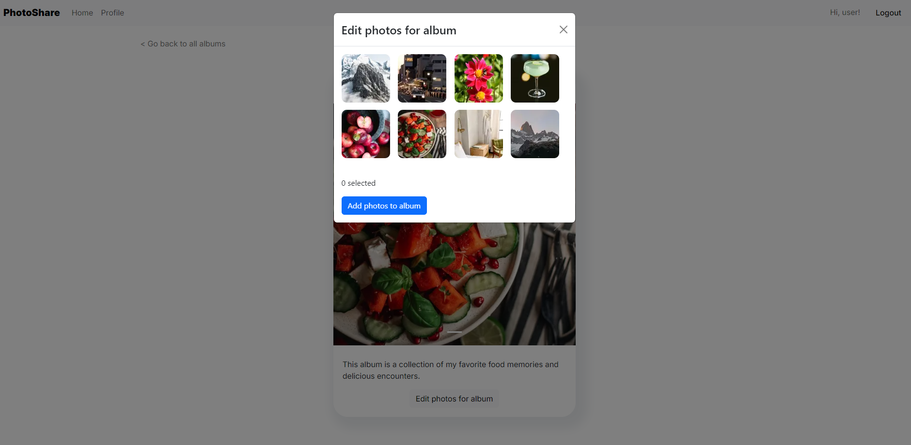

# PhotoShare Web App
A one-week group project! PhotoShare is a web application dedicated to documenting your life through photographs.

## Table of Contents
1. [Project Design](#project-design)
2. [Front End](#front-end)
3. [Development Stack](#development-stack)
4. [Database Design](#database-design)
5. [API Architecture](#api-architecture)
6. [Favorite Code](#favorite-code)
7. [Challenges](#challenges)

## Project Design
We managed our project using Trello, where we broke down bigger goals into smaller tasks.

## Front End

### Home Page
Users start on the home page, which displays the feed of all posts. If they're logged in, they can upload a new post to the feed.



### Creating a post
A logged-in user can upload a photo and create a post.



### Profile Page
Each user has a profile that contains all their posts, and any albums they've created.



### Creating an album
On your own page, you can create an album and sort your photos into there.



## Development Stack
**Front-end:** React, TypeScript, Bootstrap, Vite, Axios, Cloudinary API

**Back-end:** Java, SpringBoot, MySQL

## Database Design
  The database is designed to support a social media platform where users can create profiles, make posts, organize posts into albums, and interact through likes and comments. It includes tables for users, profiles, posts, albums, and associative tables like post_interactions for likes and comments for user feedback. This structure allows users to engage by posting content, organizing it into albums, and interacting with posts.

## API Architecture
  The API is built using Spring Boot and follows a RESTful design. It includes controllers for managing profiles, posts, albums, and comments, with REST mappings for each entity. The controllers interact with service layers and DAOs (repositories) to handle data manipulation and retrieval. This design allows for seamless integration between the back-end and the front-end, enabling users to view posts, interact with content, and track interactions like likes and comments.

## Favorite Code
### Eri
My favorite chunk of code is where I figured out how to take the photo that I upload to Cloudinary API and immediately display that back to the user during the post creation process.

```tsx
<PhotoUploadButton onPhotoUploaded={showUploadedPhoto}></PhotoUploadButton>
...
function showUploadedPhoto(public_id: string)
{
    const img = cld
    .image(public_id)
    .format("auto")
    .quality("auto")
    .resize(auto().gravity(autoGravity()).width(300).height(300));

    setUploadedImg(img);
    setPublicId(public_id);
}

async function submitHandler(event: any)
{
    event.preventDefault();

    const newPhotoPost = {
        userId: user?.id,
        publicId: publicId,
        title: title,
        captions: captions
    }

    await photoPostService.add(newPhotoPost).then(handleClose)
...
}
```

### Hannah
### Jordan
This block of code automates the process of updating the reactions column in the posts table by counting interactions from the post_interactions table. It uses a MySQL event that runs every 10 seconds, ensuring the reaction count stays accurate. This approach optimizes performance by eliminating the need for manual updates after each interaction.
```sql
SET GLOBAL event_scheduler = ON;
DROP EVENT IF EXISTS update_likes_event;

DELIMITER //
CREATE EVENT update_likes_event
ON SCHEDULE EVERY 10 SECOND
DO
BEGIN
	UPDATE posts p
	SET reactions = (
		SELECT COUNT(*)
		FROM post_interactions pi
		WHERE pi.post_id = p.post_id AND pi.interacted = TRUE
	);
END //

DELIMITER ;
```

### Tabatha
This block of code ensures that new comments are displayed without the need to refresh the page:

axios.post("http://localhost:8080/api/comments", commentData).then(response => {
      setComments([...comments, response.data]);
      setNewComment("");
    }).catch(error => {
      console.error("Error posting comment:", error);
    });
  };

## Challenges
### Eri
**Problem:** My biggest struggle was figuring out how to allow a user to select specific photos to organize into an album. 

**Approach:** I diagrammed the process out and looked into different approaches to come up with my current solution. I used the debug console a lot to smooth out issues with async functions.

**Solution:** I update an array list each time the user selects or deselects a photo, and then perform a PUT request on each photo to sort them into an album. 

### Hannah

### Jordan
**Problem:** The biggest challenge was accurately tracking reactions for each post based on user interactions without allowing multiple likes from the same user.

**Approach:** Initially, I used a simple increment and decrement method to update the reactions count, which did not account for unique user interactions.

**Solution:** I implemented a scheduled MySQL event that recalculates the reactions by counting unique interactions from the post_interactions table, ensuring accurate updates every 10 seconds.

### Tabatha
**Problem:** When users post a new comment, it doesn't immediately appear in the comments section unless the page is refreshed.

**Approach:** I leveraged React’s state management to handle the comments dynamically. 

**Solution:** The comment input is managed using the newComment state variable. When the user types, the state is updated accordingly. When the user submits the comment, an HTTP POST request is sent to the backend to save the comment. The backend responds with the newly created comment. Upon receiving the response from the backend, we use setComments([...comments, response.data]) to add the new comment to the existing comments array. This triggers React to re-render the component with the updated list of comments. The new comment is now displayed immediately without needing a page refresh, providing a seamless user experience.